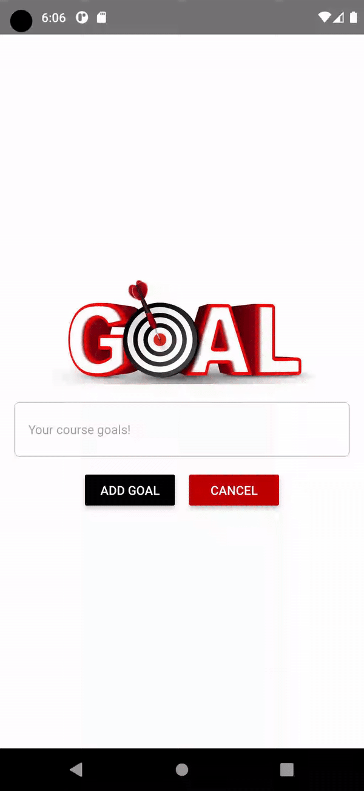

# Set Goal App

  

## Description

Set Goal is a simple mobile application built with React Native that allows you to set and manage your goals.

## Features

- **Add Goals:** Click the "Add Goal" button to add a new goal.
- **Add Goal Modal:** A modal will slide up from the bottom, allowing you to enter your goal text.
- **Add and Cancel Buttons:** Inside the modal, you can use the "Add Goal" button to add the goal to the list or the "Cancel" button to discard the goal and close the modal.
- **List of Goals:** Below the "Add Goal" button, there's a list of goals displayed in a scrollable FlatList.
- **Individual Goal Deletion:** Onclick to the list item will delete the goal item from the list.
- **Total Goal Count:** The total count of goals is displayed below the goals list.
- **Clear All Button:** Next to the total goal count, you can click the "Clear All" button to remove all goals from the list.

## Getting Started

### Prerequisites

- Node.js installed on your computer.

### Installation

1. **Clone the repository to your local machine**
2. **Navigate to the project directory**
3. **Install dependencies**
4. **Start the app**
5. **Follow the instructions in the terminal to run the app on your desired platform (iOS/Android).**

## Usage

- **Click the "Add New Goal" button** to open the Add Goal Modal.

- **Inside the modal:**
- Enter your goal text.
- Click "Add Goal" to add the goal to the list.
- Click "Cancel" to discard the goal and close the modal.

- **Manage Your Goals:**
- View your goals in the list.
- Delete individual goals using the delete button.

- **Total Goal Count:**
- The total count of goals is displayed below the goals list.

- **Clear All Goals:**
- Click the "Clear All" button to remove all goals from the list.

## Screenshots
#### ***Add Goal screen***

#### ***Goals screen***

## Contributions

Contributions to the project are welcome! If you'd like to contribute, please follow these steps:

1. Fork the repository.
2. Create a new branch for your feature.
3. Implement your changes.
4. Open a pull request detailing your changes.

## Contact

For any inquiries or support, please contact [ishikanimade56@gmail.com](mailto:ishikanimade56@gmail.com).

Feel free to customize the sections and content as per your specific application requirements and reach out to us with any questions, feedback, or suggestions you may have.

---

Thank you for using the Banking Management System developed in Kotlin! We hope this application makes managing banking operations more convenient. Your feedback is greatly appreciated.

